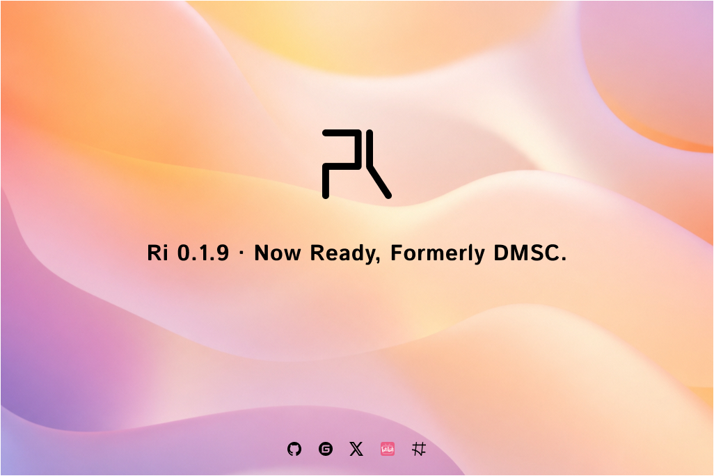

## [0.1.9] - 2026-07-10

### 🚀 Project Rename: DMSC → Ri

- Project fully renamed from "Dunimd Middleware Service (DMSC)" to "Ri"
- Crate name changed from `dmsc` to `rih` (published on crates.io as `rih`, importable as `ri` via `ri = { package = \"rih\", version = \"0.1\" }`)
- Python package renamed from `dmsc` to `ri` (directory `python/dmsc/` → `python/ri/`)
- Java package renamed from `com.dunimd.dmsc` to `com.dunimd.ri`
- All public API symbols renamed from `DMSC*` prefix to `Ri*` prefix across Rust / Python / Java / C / C++
- Repository URL updated to `https://github.com/mf2023/Ri`

### ✨ CLI Tool (`ric`)

- New `cli/` crate providing the `ric` (Ri Commander) command-line tool
- Project scaffolding via `ric new <project-type>` supporting 5 templates:
  - `minimal` — Minimal project setup
  - `api` — REST API service project
  - `web` — Web application project
  - `worker` — Background worker project
  - `microservice` — Microservice project
- Tera-based template engine with code generation
- Config generation with YAML/TOML/JSON schema validation and dependency management
- Shell completion scripts (bash, zsh, fish)
- Workspace integration with the main `ri` crate

### 🧪 Fuzz Testing

- New `fuzz/` crate with 25 fuzz targets covering:
  - Cache deserialization
  - Crypto operations (ChaCha20Poly1305, decryption, CBC, ECDSA / Ed25519 signature verification)
  - Post-quantum cryptography (Dilithium verify, Kyber decapsulate)
  - Gateway radix tree (find, parse)
  - JWT validation
  - Observability (baggage, trace context)
  - Prepared statements
  - Protocol frame (header parse, frame parse)
  - Queue message headers
  - Regex matching
  - Serialization (bincode, JSON, YAML)
  - UUID parsing
  - Data validation (email, URL, UUID)

### ☕ Java Bindings Rewrite

- All 161 Java source files rewritten under the new `com.dunimd.ri` package
- Massive API expansion adding full coverage for all modules:
  - **Core**: `RiAppBuilder`, `RiAppRuntime`, `RiServiceContext`, `RiConfig`, `RiError`, `RiErrorChain`, `RiHealthCheck*`, `RiLifecycleObserver`, `RiLockError`, `RiLogAnalyticsModule`
  - **Auth**: Full OAuth2 support, JWT management with revocation, RBAC permissions, session management
  - **Cache**: Multi-backend caching with policies, stats, events
  - **Database**: Connection pooling, migrations, metrics, dynamic pool config
  - **Device**: Device control, health metrics, resource allocation & scheduling, network discovery
  - **Gateway**: Router, rate limiter (sliding window), circuit breaker, load balancer
  - **gRPC**: Server & client support
  - **Hooks**: Event bus, module phases
  - **Log**: Configurable logging with levels
  - **ModuleRPC**: Inter-module RPC framework
  - **Observability**: Metrics registry, tracing, system / CPU / memory / disk / network metrics
  - **Protocol**: Frame-based protocol handling with connection management and security levels
  - **Queue**: Multi-backend queuing with retry policies & dead letter queues
  - **Service Mesh**: Service discovery, traffic routing, health checking
  - **Validation**: Schema validation, sanitization, severity-based error reporting
  - **WebSocket**: Server & client

### 🔧 Build System & CI/CD

- New `Makefile` (723 lines) providing unified build system for all platforms and targets
- Cargo workspace configuration (main `ri` crate + `ric` CLI, resolver v2)
- CI/CD pipeline completely reworked:
  - Multi-platform wheel builds: Linux x64/ARM64, Windows x64/ARM64, macOS x64/ARM64
  - Docker-based manylinux builds for Python wheels
  - Cross-compilation support with automatic platform detection
  - Native library artifact packaging per platform
- `bindings` feature flag added (aggregates `pyo3` + `c` + `java`)
- `protocol-advanced` feature flag for future/experimental protocol features
- Default features adjusted: removed pyo3/java from defaults, `c` added by default

### 📦 Dependencies & Platform Updates

- Added `sha2` crate for key fingerprinting
- Upgraded `sqlx` from 0.7 to 0.8; removed direct `rusqlite` dependency
- Post-quantum crypto: `oqs` switched to vendored build (v0.10, features: `kems`, `sigs`, `std`)
- Platform-specific dependency strategy for `openssl-sys` and `rdkafka`:
  - Linux: system OpenSSL + system GSSAPI/SASL (avoid vendored build issues on manylinux)
  - Windows: vendored OpenSSL, SSPI for Kerberos

### 📝 Documentation

- `ANNOUNCEMENT.md` and `ANNOUNCEMENT.zh.md` added
- `CONTRIBUTING.md`, `CODE_OF_CONDUCT.md`, `SECURITY.md` updated for Ri
- README / README.zh updated for new branding
- Docs CI pipeline updated: `OPENSSL_NO_VENDOR=1`, `liboqs-dev` installation
- `assets/svg/ri.svg` added; `dmsc.svg` removed

### ⚡ Core Refactoring

- All 20+ core modules refactored: core, auth, cache, config, database, device, fs, gateway, grpc, hooks, log, module_rpc, observability, protocol, queue, service_mesh, validation, ws
- C API headers regenerated via cbindgen
- Python / C / C++ / Rust examples and test files updated for new Ri API

---

## [0.1.8] - 2026-04-05

- Fix some known issues
- Optimize the performance of some scenarios

---

## [0.1.7] - 2026-02-17

## This version is a beta version with incomplete functionality and may pose risks. It is not recommended for production environments or official use.

- Fix some known issues

---

## [0.1.6] - 2026-02-01

## This version is a beta version with incomplete functionality and may pose risks. It is not recommended for production environments or official use.

### ✨ Added

#### Core Module
- Added `with_cache_module()` method to RiAppBuilder for cache module configuration
- Added `with_auth_module()` method to RiAppBuilder for auth module configuration
- Added `with_queue_module()` method to RiAppBuilder for queue module configuration
- Added `with_device_module()` method to RiAppBuilder for device module configuration
- Changed `with_logging()` and `with_observability()` return types from `RiResult<Self>` to `Self`

#### Python Bindings
- Added RiAppBuilder to Python bindings (previously Rust-only)
- Added RiHealthCheckType enum export
- Added RiHealthSummary struct export
- Added RiTrafficManager export
- Added Python ORM Repository support (py_repository.rs)
- Added comprehensive Python import tests (tests/Python/dmsc_imports.py)
- Added comprehensive Python example (examples/Python/comprehensive_example.py)

#### Cache Module
- Added `with_config()` method to RiCacheModule for backend-based configuration

#### Project Configuration
- Added `.cargo/config.toml` for Cargo configuration
- Added `CODE_OF_CONDUCT.md`
- Added `CONTRIBUTING.md`
- Added `SECURITY.md`
- Added project logo `assets/svg/dmsc.svg`

### 🔧 Changed

#### Documentation Restructure
- Renamed `mq.md` to `queue.md` (message queue documentation unified)
- Removed `http.md`, `orm.md`, `security.md`, `storage.md` (content merged into other docs)
- Added comprehensive `ws.md` (WebSocket documentation)
- Updated all API reference documentation
- Updated all usage example documentation

#### Python Examples
- Completely rewrote all Python examples to match actual API

#### Rust Source
- Improved error handling in auth module (replaced expect() with proper error returns)
- Improved PyErr to RiError conversion
- Updated post-quantum cryptography implementations (dilithium, falcon, guomi, kyber)
- Improved Kafka backend and queue manager

### 🗑️ Removed

- Removed `src/queue/backends/kafka_windows_stub.rs`

### 🐛 Fixed

- Fixed missing Python type exports in lib.rs
- Fixed auth module RedisError import reference
- Fixed cache module with_config() backend creation
- Fixed README.md and README.zh.md code examples
- Fixed documentation code examples (missing semicolons, incorrect package names)
- Fixed RiAppBuilder method return types in documentation (with_logging, with_observability)
- Fixed OAuth API documentation to match actual implementation
- Fixed RiCacheManager method signatures in Chinese documentation
- Fixed RiAppRuntime documentation (removed non-existent methods)
- Ensured Chinese and English documentation consistency

---

## [0.1.5] - 2026-01-24

## This version is a beta version with incomplete functionality and may pose risks. It is not recommended for production environments or official use.

### ✨ Added

#### WebSocket Client Support
- Added WebSocket client implementation (src/ws/client.rs)
- Added RiFrameParser for protocol frame parsing
- Added RiFrameBuilder for protocol frame construction

#### Python Test Suite
- Added comprehensive Python test suite (tests/Python/)
- Added 12 Python test files covering core, cache, device, gateway, and service_mesh modules
- Added pytest integration for Python testing

#### Python Examples
- Added Python usage examples (examples/Python/)
- Added 10 example files demonstrating various Ri features
- Added examples for authentication, caching, device management, and more

#### Health Check Subsystem
- Added RiHealthStatus enum for health state representation
- Added RiHealthCheckResult struct for individual check results
- Added RiHealthCheckConfig struct for check configuration
- Added RiHealthReport struct for comprehensive health reports
- Added RiHealthChecker trait for custom health check implementations

#### Lifecycle Management
- Added RiLifecycleObserver for module lifecycle monitoring
- Added RiLogAnalyticsModule for log analytics

#### Error Chain Support
- Added RiErrorChain for comprehensive error chain traversal
- Added RiErrorChainIter for iterator-based error traversal
- Added RiErrorContext for contextual error information
- Added RiOptionErrorContext for optional error context

#### Distributed Lock
- Added RiLockError for lock operation errors

#### Python Module Integration
- Added RiPythonModule for Python module integration
- Added RiPythonModuleAdapter for module adaptation
- Added RiPythonServiceModule for service module support
- Added RiPythonAsyncServiceModule for async service modules

#### Auth Module Enhancements
- Added RiJWTClaims for comprehensive JWT claims
- Added RiJWTValidationOptions for JWT validation configuration
- Added RiOAuthProvider enum for OAuth provider selection
- Added RiJWTRevocationList for token revocation
- Added RiRevokedTokenInfo for revoked token metadata

#### Device Module Enhancements
- Added RiDeviceSchedulingConfig for scheduling configuration
- Added RiResourceScheduler for resource scheduling
- Added RiDeviceScheduler for device-level scheduling
- Added RiSchedulingPolicy for scheduling strategy
- Added RiAllocationRecord for allocation tracking
- Added RiAllocationRequest for allocation requests
- Added RiAllocationStatistics for allocation metrics
- Added RiSchedulingRecommendation for scheduling suggestions
- Added RiSchedulingRecommendationType for recommendation types
- Added RiDeviceTypeStatistics for device type metrics

#### Service Mesh Enhancements
- Added RiServiceMeshStats for service mesh statistics
- Added RiTrafficManager for traffic management
- Added RiHealthChecker for health checking

#### Database ORM Enhancements
- Added ColumnDefinition for column schema
- Added IndexDefinition for index schema
- Added ForeignKeyDefinition for foreign key constraints
- Added TableDefinition for table schema
- Added LogicalOperator for query logic
- Added Criteria for query criteria
- Added JoinClause for table joins
- Added ComparisonOperator for query comparisons
- Added SortOrder for sorting options
- Added Pagination for paginated queries
- Added QueryBuilder for query construction
- Added JoinType for join types

#### Gateway Enhancements
- Added RiBackendServer for backend server representation
- Added LoadBalancerServerStats for load balancer statistics

#### Observability
- Added RiObservabilityData for unified observability data

### 🔧 Changed

#### Protocol Module
- Removed experimental warning, now production-ready
- Improved protocol safety and stability

#### Auth Module
- Renamed JWTClaims to RiJWTClaims following Ri naming convention
- Renamed JWTRevocationList to RiJWTRevocationList
- Added Ri prefix to OAuth provider types

#### Device Module
- Enhanced device scheduling capabilities
- Improved resource allocation algorithms

#### Database ORM
- Expanded ORM functionality with comprehensive schema definitions
- Enhanced query building capabilities

### 🗑️ Removed

#### Python API
- Removed RiAppBuilder from Python bindings (Rust-only)
- Removed RiSecurityManager from Python bindings (simplified)

#### Deprecated Tests
- Removed tests/core/core_error_chain.rs
- Removed tests/core/core_health.rs
- Removed tests/protocol/protocol_crypto.rs
- Removed tests/protocol/protocol_frames.rs
- Removed tests/protocol/protocol_integration_core.rs

#### Test Structure
- Moved tests from tests/*.rs to tests/Rust/*.rs

---

## [0.1.4] - 2026-01-17

## This version is a beta version with incomplete functionality and may pose risks. It is not recommended for production environments or official use.

### ✨ Added

#### Device Discovery Module
- Added new Device Discovery module with cross-platform support
- Added platform detection (Linux, macOS, Windows)
- Added hardware providers for CPU, Memory, Storage, Network, GPU, USB
- Added extensible plugin system for custom discovery implementations
- Added ProviderRegistry for centralized provider management
- Added PluginRegistry for plugin lifecycle management

#### Cache Module Enhancements
- Added bulk operations to RiCache trait (get_multi, set_multi, delete_multi, exists_multi)
- Added keys() method for cache key enumeration
- Added delete_by_pattern() for pattern-based cache invalidation
- Added last_accessed field to RiCachedValue for LRU support
- Added touch() and is_stale() methods for cache entry tracking
- Added async new() method to RiCacheModule with Redis auto-fallback

#### Logging Module Enhancements
- Added RiLogLevel::from_env() for environment-based log level configuration
- Added RiLogLevel::from_str() for string parsing
- Added RiLogConfig::from_env() for environment-based logging configuration

### 🔧 Changed

#### Module Import Path Fix
- Fixed module import path from `dms::prelude::*` to `dmsc::prelude::*`

#### Error Handling Improvements
- Improved lock poisoning handling with expect instead of unwrap

#### Documentation
- Added comprehensive Rustdoc comments to cache core module
- Added usage examples to documentation

---

## [0.1.3] - 2026-01-04

## This version is a beta version with incomplete functionality and may pose risks. It is not recommended for production environments or official use.

### ✨ Added

#### Python Module Support
- Added Python module adapter support, including RiPythonModule, RiPythonModuleAdapter, RiPythonServiceModule, RiPythonAsyncServiceModule
- Created modular Python submodule structure (dmsc.log, dmsc.config, dmsc.device, dmsc.cache, dmsc.fs, dmsc.hooks, dmsc.observability, dmsc.queue, dmsc.gateway, dmsc.service_mesh, dmsc.auth)
- Each submodule contains corresponding type bindings, providing clearer API organization

#### Device Module Enhancements
- Added RiDiscoveryResult type for structured device discovery result representation
- Added RiResourceRequest type for standardized resource request definition
- Added RiRequestSlaClass type for SLA-level resource request classification
- Added RiResourceWeights type for flexible resource weight configuration
- Added RiAffinityRules type for affinity rule definition and application
- Added RiResourceAllocation type for resource allocation result representation
- Added RiDeviceStatus enum for standardized device status definition
- Added RiDeviceCapabilities struct for detailed device capability description
- Added RiDeviceHealthMetrics struct for device health metrics collection and representation

#### Observability Module Enhancements
- Added RiObservabilityData type for unified observability data structure representation
- Added RiMetricsRegistry type for metrics registry creation and management
- Added RiTracer type for standardized distributed tracing implementation

#### Service Mesh Module Enhancements
- Added RiServiceInstance type for standardized service instance representation
- Added RiHealthChecker type for unified health check implementation
- Added RiTrafficManager type for flexible traffic management configuration

### 🔧 Changed

#### Prelude Export Optimization
- Reorganized prelude module export structure
- Provided clearer API import paths and usage methods
- Optimized import dependency relationships between modules

#### Documentation Structure Refactoring
- Migrated documentation directory from python/doc/ to doc/
- Achieved centralized document management and unified maintenance
- Synchronized Chinese and English document content updates

#### Precompiled Binary Support
- Added precompiled Python wheel packages (dmsc_0.1.3_linux.whl, dmsc_0.1.3_windows.whl)
- Added precompiled Rust library files (libdmsc.rlib, libdmsc.dll)
- Provided more convenient deployment and integration methods

### 🗑️ Removed
- Removed python/setup.py file

### ⚠️ Breaking Changes

#### Python Module Structure Changes
- Python submodule structure has changed, existing code may need to update import statements
- Recommendation: Adjust import statements from single module import to submodule import

#### Documentation Path Changes
- python/doc/ directory has been deleted, all documentation has been migrated to doc/ directory
- References relying on old documentation paths need to be updated

---

## [0.1.2] - 2025-12-13

### ✨ Added
- Initial release version
- Provided 12 core functional modules: core, config, log, auth, cache, queue, device, gateway, service_mesh, protocol, observability, fs
- Supported Rust and Python dual-language bindings
- Provided complete error handling and logging functionality
- Supported multi-backend cache and message queue
- Provided device management and resource scheduling functions
- Supported service mesh and service discovery
- Provided observability functions (metrics, tracing)
- Supported configuration management and hot reload
